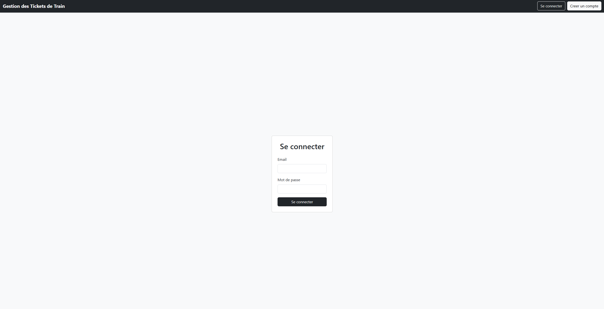

# Train Ticket Management System - MavenG4

## Description
This project is a web application developed using Java Enterprise Edition (JEE) with servlets, JSP (JavaServer Pages), and JSTL (JavaServer Pages Standard Tag Library). It provides a comprehensive train ticket management system with features for both users and administrators.

## Features
### For Users:
- **Login and Account Creation**: Users can log in or create a new account.
- **Search Trajet**: Search for available train routes.
- **Booking**: Ability to book a ticket.
- **Return Booking**: Option to book a return ticket.
- **Cancellation**: Request to cancel a booking.

### For Administrators:
- **Add Trajets**: Add new train routes to the system.
- **User Management**: View, edit, or delete user information.
- **Request Validation**: Accept or decline cancellation requests.

## Technologies Used
- **Language**: Java
- **Framework**: JEE
- **Web Technologies**: Servlets, JSP, JSTL
- **Database**: MySQL

## Installation
1. Clone the repository: `git clone <repository-URL>`
2. Set up your JEE environment (e.g., Tomcat).
3. Import the project into your IDE (e.g., Eclipse).
4. Configure the database if necessary.
5. Compile and deploy the application on the server.

## Usage
- Access the homepage at `http://localhost:8080/MavenG4/pageacceuil.jsp`.
- Follow the on-screen instructions to log in, book tickets, or manage routes.

## Screenshots

## Contributors
- Chedy Chaaben (chedychaaben@gmail.com)

## Notes
This project is under development. Contributions and suggestions are welcome!